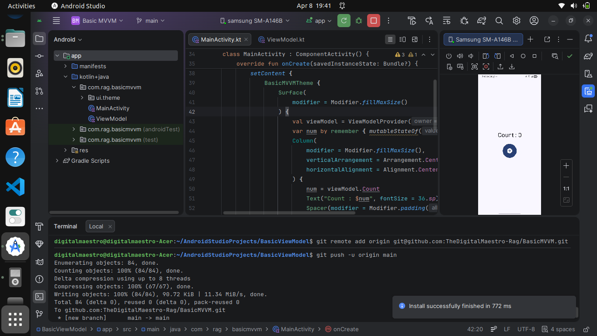
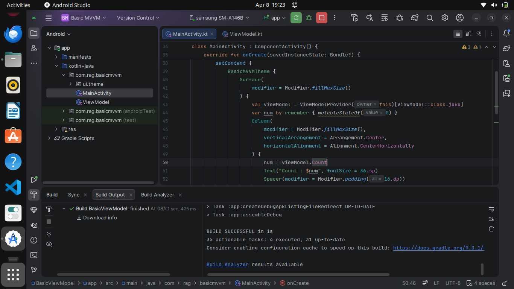

# 📱 Basic MVVM Counter App (Android - Kotlin + Jetpack Compose)

A simple and beginner-friendly Android application built to understand and implement the **MVVM (Model-View-ViewModel)** architecture using **Kotlin** and **Jetpack Compose**.

---

## 🚀 Features

- 🔢 Increment Counter
- 🔽 Decrement Counter
- 🔄 Real-time UI updates
- 🧠 ViewModel-based state management
- 🧼 Clean and simple MVVM structure

---

## 🛠️ Tech Stack

- **Language:** Kotlin  
- **UI Toolkit:** Jetpack Compose  
- **Architecture:** MVVM  
- **IDE:** Android Studio  

---

## 📱 Screenshots

### 🔹 Initial Counter State

### 🔹 Updated Counter State

> 📌 Make sure to add your screenshots inside a folder named `screenshots` in the project root.

---

---

## 🧠 How It Works

This app follows the **MVVM architecture pattern**:

### 🔹 Layers Explanation

| Layer       | Role |
|------------|------|
| Model      | Holds the counter data |
| View       | Displays UI using Compose |
| ViewModel  | Manages state and logic |

### 🔹 Flow

1. User clicks Increment/Decrement button  
2. UI sends event to ViewModel  
3. ViewModel updates the counter value  
4. UI automatically recomposes with new state  

---

## 📂 Project Structure
